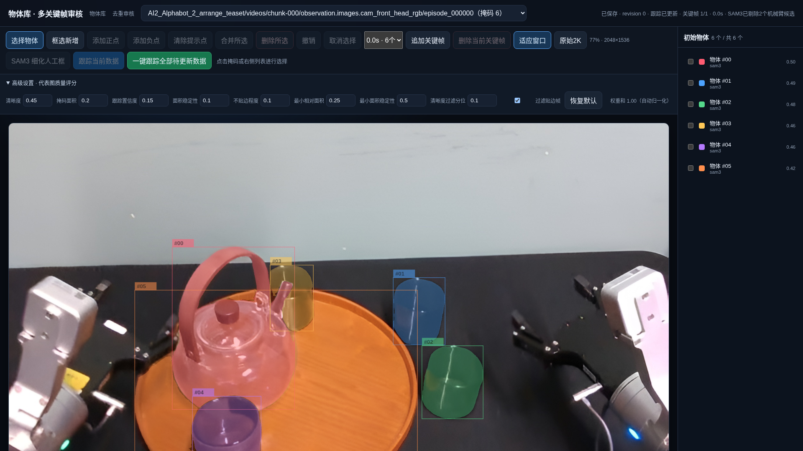
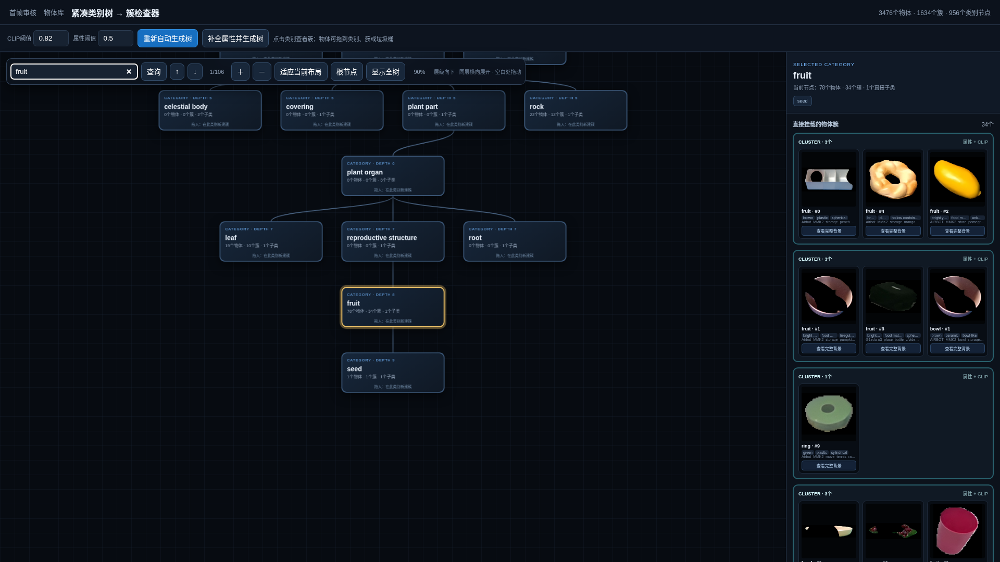
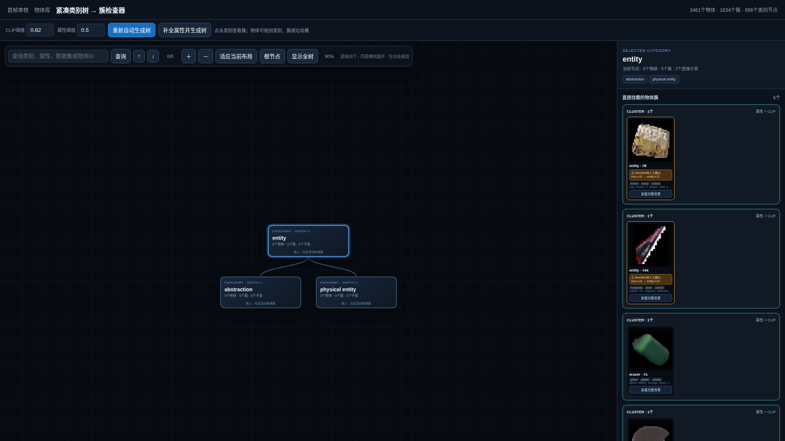
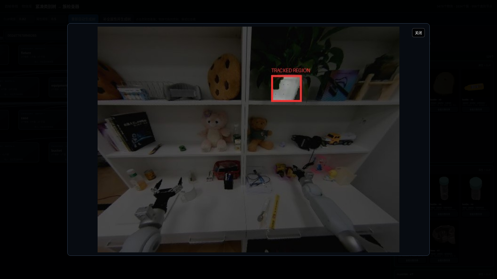

# RoboCOIN Object Manager 数采员操作手册

> 只操作网页。不要修改程序参数，也不要删除 `objects/` 中的文件。

## 1. 工作流程

| 顺序 | 页面 | 任务 |
|---|---|---|
| 1 | `http://127.0.0.1:8888/review` | 审核掩码并跟踪 |
| 2 | `http://127.0.0.1:8888/dedup` | 调整类别和物体簇 |
| 3 | `http://127.0.0.1:8888/new-library` | 检查最终物体库 |

页面显示“处理中”时，等待任务完成。不要连续点击按钮，也不要关闭运行服务的终端。

> 下面所有图片均截自当前程序的真实页面。数据名、物体数量和置信度仅作操作示例。

## 2. 掩码审核 `/review`

### 每条数据怎么做

1. 从顶部下拉框选择数据。
2. 检查画面和右侧的每个掩码。
3. 删除机械臂、背景、无关物体、重复或错误掩码。
4. 有漏检就框选新增；一帧看不全就追加关键帧。
5. 确认所有关键帧后，点击“跟踪当前数据”。
6. 状态显示“跟踪已更新”后，这条数据才算完成。


画面中的彩色区域是掩码，右侧列表与画面中的物体编号一一对应。

### 什么该留，什么该删

| 保留 | 删除 |
|---|---|
| 任务中会操作的独立物体 | 机械臂、夹爪、机器人手 |
| 需要进入物体库的物体 | 墙、桌面、地面、阴影和反光 |
| 主要操作区域内的相关物体 | 远处无关物体和重复掩码 |
| 一个掩码对应一个物体 | 同时覆盖多个物体的错误掩码 |

系统不会自动删除画面上方或面积较小的物体，是否保留由数采员根据任务内容判断。

系统首先使用通用 `object` 提示，再补充数据名称、`meta/tasks.jsonl` 和当前 episode 的 `meta/episodes.jsonl` 任务名词；不读取噪声较多的场景描述和 subtask。例如 `test_tube` 会归一化为 `test tube`。图像编码一次后，每个提示分别检测并合并去重。数采员不需要填写提示词；候选不能保证都正确，仍按上表删除机械臂、背景和无关物体。

### 删除、合并或取消选择

点击画面中的掩码，或点击右侧对应的物体行。选中后掩码边框和右侧物体行会高亮，再选择“合并所选”或“删除所选”。


### 漏检物体

1. 点击“框选新增”，框住一个完整物体，边缘留少量空隙。
2. 框内只有目标时，直接点击“SAM3 细化人工框”。
3. 框内有其他物体时，在目标内部添加绿色正点，在背景或其他物体上添加红色负点。
4. 检查细化结果；不正确就调整框或点，再次细化。

一个框只标一个物体。人工框必须经过细化，不能把矩形直接当作最终掩码。


白色虚线是正在拖动的人工框。松开鼠标后，选中这个人工框，就可以使用“添加正点”和“添加负点”。

### 一帧看不全

1. 点击“追加关键帧”。
2. 拖动时间轴，找到目标清楚可见的画面。
3. 点击“确认并追加发现”。
4. 在关键帧下拉框中逐帧检查新掩码。

拖动时是原视频预览；确认后会生成2K审核图。选错时，选择该关键帧并点击“删除当前关键帧”。每条数据至少保留一张关键帧。


弹窗中可拖动下方时间轴；只有点击“确认并追加发现”后，才会运行超分和 SAM3。

### 常用按钮

| 按钮 | 作用 |
|---|---|
| 框选新增 | 给漏检物体画框 |
| 添加正点 / 添加负点 | 指定目标或需要排除的区域 |
| SAM3 细化人工框 | 把矩形变成贴合物体的掩码 |
| 合并所选 | 合并属于同一个物体的多个掩码 |
| 删除所选 | 删除错误、重复或无关掩码 |
| 撤销 | 恢复最近一次操作 |
| 适应窗口 | 显示完整2K画面 |
| 原始2K | 按 1:1 像素查看；滚轮可缩放 |
| 跟踪当前数据 | 跟踪当前审核结果 |
| 一键跟踪全部待更新数据 | 只跟踪修改过的数据 |

新增、删除、合并或细化掩码后，状态会变为“等待跟踪”。跟踪成功后自动变回“跟踪已更新”；失败的数据仍保持“等待跟踪”。页面操作会自动保存。

跟踪期间不要继续修改同一条数据。如果确实发生修改，系统会保留“等待跟踪”状态，必须再次跟踪；不会把运行中的旧结果误认为已经包含新修改。跟踪被取消或报错时，上一版完整结果仍可使用，不要手工清理临时目录或归档。

### 高级设置



这些参数决定跟踪后如何选代表图。数采员通常保持默认值；没有技术人员指示时不要修改。

### 完成标准

- 没有明显漏检；
- 一个掩码只对应一个物体；
- 没有机械臂、背景、重复和无关掩码；
- 所有人工框已经细化；
- 所有关键帧已经检查；
- 状态为“跟踪已更新”。

## 3. 属性树与去重 `/dedup`

### 操作顺序

1. 所有待更新数据跟踪完成后，点击“补全属性并生成树”。
2. 点击类别节点，在右侧检查物体簇。
3. 拖动物体卡，修正类别、拆分或合并物体簇。
4. 把机械臂、背景和无意义图片拖入垃圾桶。
5. 处理橙色“WordNet待人工确认”提示。
6. 完成后进入 `/new-library` 抽查结果。


点击树上的节点后，右侧只显示直接挂在当前节点的物体和簇，不包含子节点。

### 搜索并检查类别

在左上角输入类别、属性、数据集名或物体 ID，点击“查询”。使用“↑”和“↓”切换搜索结果。



### WordNet 路径待确认

看到橙色“WordNet待人工确认”时，说明 VLM 返回的路径无法直接对应到 WordNet。结合物体图和完整背景，把它拖到正确类别。



### 裁图不好判断

点击物体卡上的“查看完整背景”，弹窗会显示该物体所在的完整场景图。
红框表示真实掩码的外接范围，不再包含裁图留白。



### 最重要的判断

- 同一个真实物体的不同图片：放进同一簇。
- 同类但不是同一个实物：必须放在不同簇。
- 类别不对：拖到正确且尽量具体的类别节点。
- 机械臂、背景或无意义裁图：拖到垃圾桶。
- 不确定时点击“查看完整背景”，结合原场景判断。

树上的拖动和垃圾桶操作会立即保存。重新生成树时，图像没有变化的物体会继承人工类别、分簇和垃圾桶状态；变化或新增的物体会重新分配。旧树也会自动归档。

### 完成标准

- 每个簇只包含同一个真实物体；
- 同类的不同实物没有被错误合并；
- 类别正确，WordNet 警告已处理；
- 无效物体已放入垃圾桶。

## 4. 最终检查 `/new-library`

检查物体总数是否合理，并随机打开一些物体查看图片和来源。

如果页面提示“物体库已过期”，返回 `/dedup` 点击“补全属性并生成树”。这表示跟踪图、属性或类别在上次建库后发生变化，系统已阻止展示新旧混合结果。


点击任意物体卡进入详情页，检查它的属性和所有实例图是否属于同一个真实物体。

物体 ID 按首次确认的类别分别从 0 永久分配，例如 `cup_0`、`cup_1`、`cup_2`。该值同时是页面名称和系统主键；实例增减、类别修正或其他对象删除后都不会重新编号，删除对象占用过的编号也不会复用。


发现类别错误、重复物体或垃圾物体时，返回 `/dedup` 调整，不要直接修改文件。

## 5. 物体名词 ID 审核

完成物体库建库后运行：

```bash
python object_text_linker.py --generate
python viewer.py
```

打开 `http://127.0.0.1:8888/object-links`。系统只自动替换当前数据集内能够唯一确认的物体；其余条目进入“待审核”。同一数据集里重复出现的相同名词和候选集合合并成一条，卡片会显示重复次数。展开“查看画面与视频”可以查看对应 episode 的代表画面，并播放该 episode 的所有相机视频。场景、子任务和 episode 文本按行号关联 episode；数据集级 `tasks.jsonl` 没有逐帧时间信息，页面会明确显示为“代表 episode”。数采人员可以结合画面勾选一个或多个候选图片，搜索整个物体库或直接输入永久 ID，然后点击“保存替换”；确认不是目标物体时点击“标记非物体”。保存后只更新 `RoboCOIN_object_linked/` 中对应数据集的镜像 JSONL，`RoboCOIN_datasets/` 原文件不会修改。

镜像文本用方括号表示 ID，例如 `Pick up the [apple_2]`。每条记录同时保留 `source_*` 原文、`object_ids` 和 `object_mapping_status`，便于回查和程序读取。

## 6. 常见情况

### SAM3 细化选到背景

缩小人工框，在目标内部加正点，在背景、机械臂或邻近物体上加负点，然后重新细化。仍不正确时换一张关键帧。

### 页面很慢

第一次 SAM3 操作需要加载模型。跟踪、2K超分和属性生成也需要时间。页面显示“处理中”时耐心等待，不要重复提交。

### CUDA out of memory

取消任务并等待显存释放，保存完整报错并联系技术人员。不要自行限制图像尺寸或删除缓存。

### VLM 进度分母变化

分母是本次需要重新计算的数量。缓存和数据变化会改变分母，已完成的有效缓存不会丢失。

## 7. 设备要求

| 项目 | 最低 | 推荐 |
|---|---|---|
| GPU | NVIDIA CUDA，8 GB显存 | 12 GB及以上显存 |
| 内存 | 16 GB，并有16 GB交换空间 | 32 GB及以上 |
| CPU | 8核 | 12核及以上 |
| 磁盘 | SSD，剩余50 GB | NVMe SSD，剩余100 GB以上 |
| 屏幕 | 1920×1080横屏 | 2K横屏 |

运行前关闭其他占用GPU的程序。不要同时运行SAM3细化、视频跟踪和属性生成。磁盘剩余低于20 GB时停止批量任务并联系技术人员。

## 8. 数据安全与异常上报

- 页面操作自动保存，掩码操作可以撤销；
- 垃圾桶是软删除，不会删除原始跟踪记录；
- 不要手工修改或删除 `objects/` 下的文件；
- 批量覆盖或清空数据前先联系技术人员。

报错时请提供：数据名称、视频或相机路径、关键帧时间、执行的操作、期望结果、实际结果、完整报错和截图。

## 9. 更新记录

| 日期 | 变更 |
|---|---|
| 2026-09-03 | 单帧SAM3发现恢复`object`，并补充数据名称及当前episode的meta任务名词；每个提示独立检测并跨提示合并去重，不读取场景描述和subtask。 |
| 2026-09-02 | 名词 ID 审核页新增 episode 代表画面和多相机视频播放；数据集级任务会明确标记为代表 episode，避免误认为精确时间定位。 |
| 2026-09-02 | 新增物体名词到永久 ID 的镜像转换和人工审核页；唯一候选自动替换，重复映射合并审核，保存时绝不覆盖原始 JSONL。 |
| 2026-08-31 | 新增物体名词文本精简下载：只拉取任务、episode、场景和子任务 JSONL，不再为名词映射下载关节状态与动作 Parquet。 |
| 2026-08-31 | `cup_0`、`cup_1` 等可读名称改为持久对象 ID；通过独立注册表继承历史 ID，实例增减、类别修正和删除均不再触发重编号。 |
| 2026-08-31 | 跟踪增加审核版本保护和目录级原子提交；运行中发生新修改时继续保持“等待跟踪”，失败不再留下新旧混合结果。 |
| 2026-08-31 | 去重候选与物体库增加来源指纹校验；过期结果不再展示，失败的人工决定自动回滚，修改类别会重新放置受影响物体。 |
| 2026-08-31 | 明确新机器部署完成后在本机独立启动和访问，旧机器只用于首次迁移。 |
| 2026-08-31 | 修正数据名语义提示的英文复数归一化，避免 `tennis`、`wipes` 等词被错误截断；重新生成独立量化报告。 |
| 2026-08-27 | SAM3 首帧与追加关键帧自动使用数据名称中的名词和复合名词补检；原 `object` 掩码优先保留，新增候选仍需人工审核。 |
| 2026-08-27 | 修复人工树完整背景缺失和掩码错位；新结果保存精确坐标，旧结果自动做2K比例校正，物体卡改用无损预览。 |
| 2026-08-27 | 新增远程一键部署脚本，旧机器可通过 SSH 自动同步全部数据并在新机器创建环境。 |
| 2026-08-27 | 操作手册全部改用真实页面截图，新增多选掩码、拖框、追加关键帧、高级设置、类别搜索、WordNet 警告、完整背景和物体详情等场景。 |
| 2026-08-27 | 新增另一台机器的快速部署指南，覆盖完整数据迁移、安装、验证和启动。 |
| 2026-08-27 | 超分严格对照纳入全部旧隐藏候选，并排除所有有人工 revision 的数据。 |
| 2026-08-27 | 超分报告完整保留全部明显变化对比图，另提供少量精选图快速查看。 |
| 2026-08-27 | 超分报告改为分层精选明显变化样本，对比图增加单掩码及平均置信度。 |
| 2026-08-27 | 操作手册改为简明步骤，并增加页面流程、掩码提示和人工调整树示意图。 |
| 2026-08-27 | 新增 `reports/` 效果评估目录，保存超分前后统计、明显变化对比图和人工复核表。 |
| 2026-08-26 | 审核图、最佳图、VLM 和 CLIP 使用2K图；跟踪仍使用原始视频帧。 |
| 2026-08-26 | 增加多关键帧、可撤销删除和实时掩码数量。 |
| 2026-08-26 | 人工框支持正负点提示，并使用SAM3原生交互分割。 |
| 2026-08-26 | 重新生成树时继承未变化物体的人工调整。 |
| 2026-08-26 | 一键跟踪只处理修改过的待更新数据。 |
