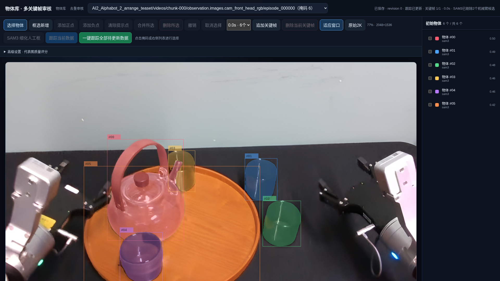
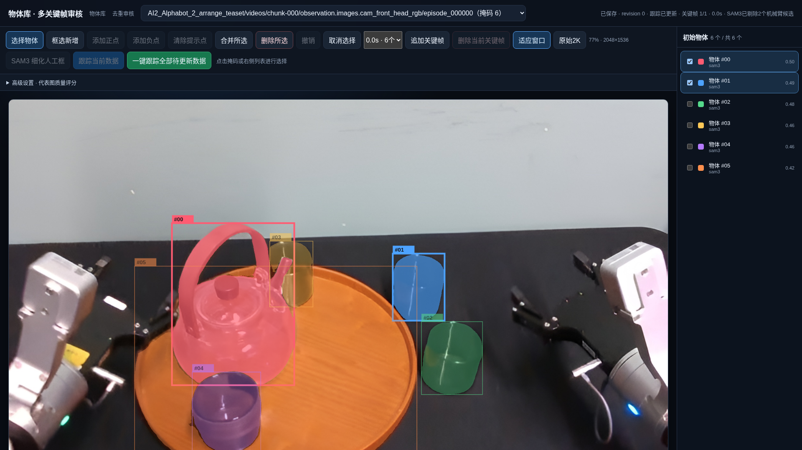
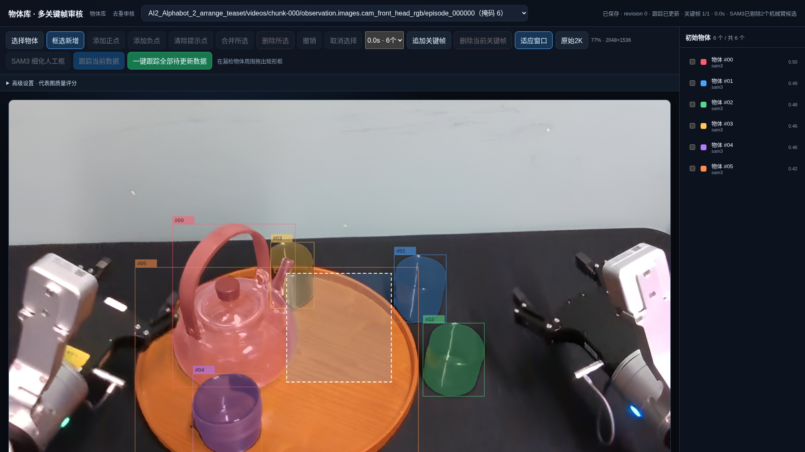
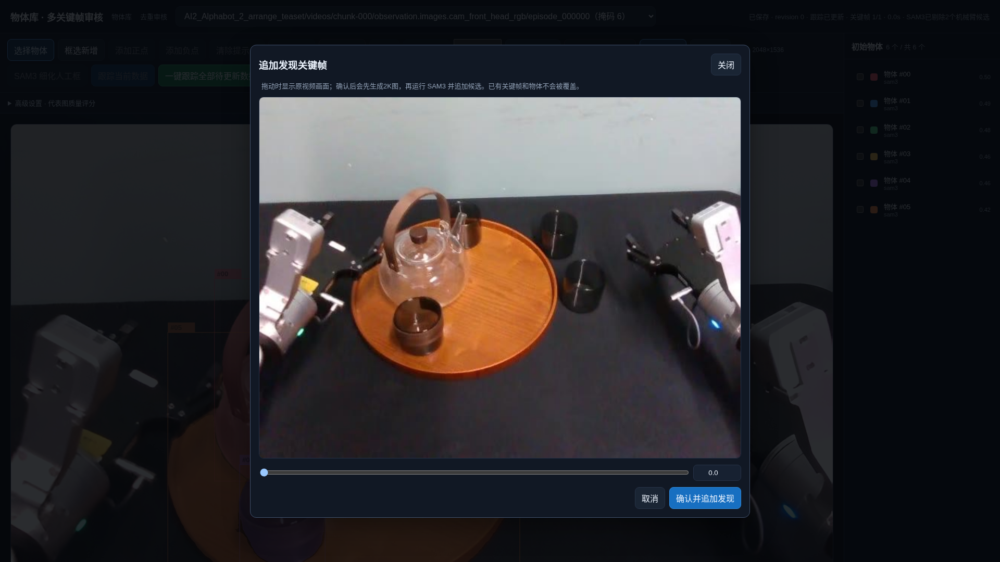
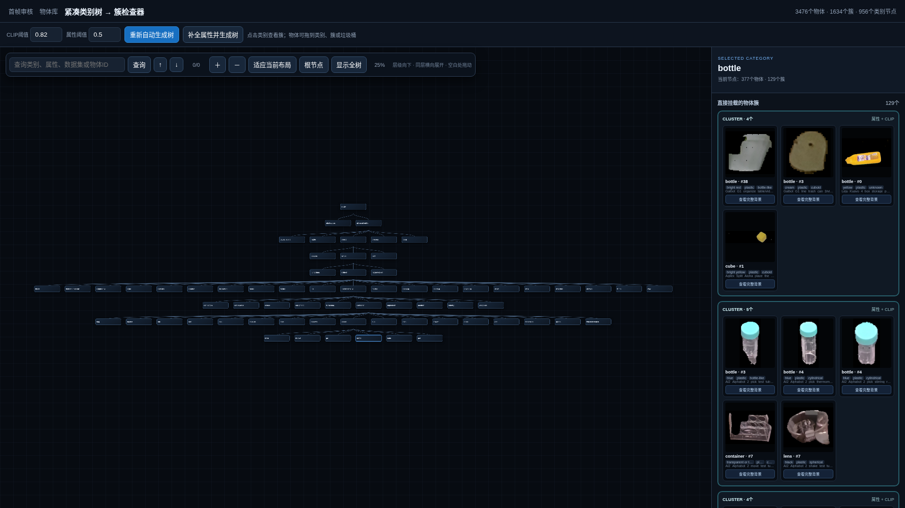
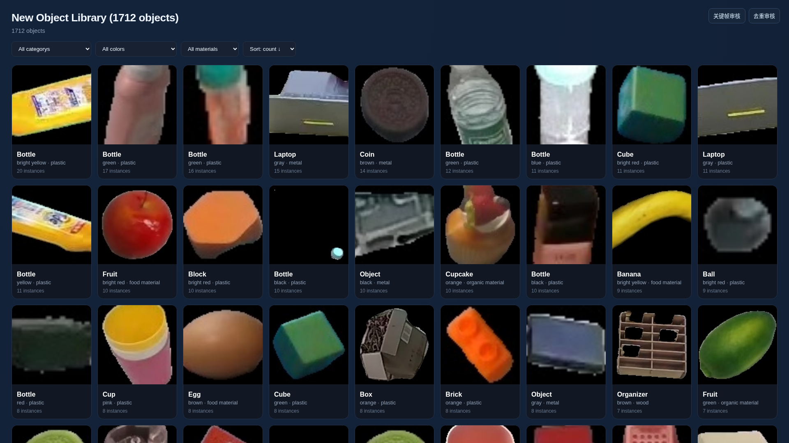
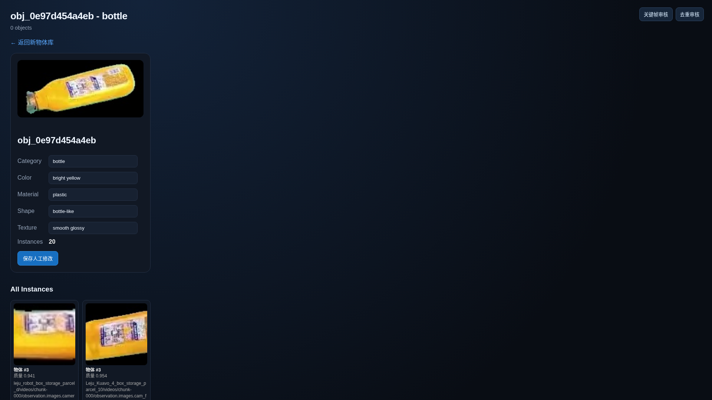

# RoboCOIN 数采员操作手册

> 你只需要用浏览器操作网页。不要改程序参数，不要删除 `objects/` 里的文件，不要关闭运行服务的终端。

## 0. 你的工作是什么（30 秒看懂）

机器人视频里，程序会自动标出画面中的物体。**彩色轮廓 = 掩码 = 一个物体**。

你的工作是分三步检查：

| 顺序 | 页面 | 做什么 |
|---|---|---|
| 1 | `/review` | 审核掩码：删错的、补漏的 |
| 2 | `/dedup` | 整理类别和物体组：告诉系统哪些图是同一个物体 |
| 3 | `/new-library` | 抽查最终物体库 |

记牢一句话：**一个掩码只对应一个物体；同一个真实物体只保留一组。**

---

## 1. 打开页面

双击或在程序目录运行 `./start_collector.sh`。启动检查通过后，浏览器会自动打开 `http://127.0.0.1:8888`。运行期间保持启动窗口开启；关闭窗口会停止程序。

**通用规矩**

- 页面显示“处理中 / 加载中”时，耐心等待，不要反复点按钮；
- 你的操作会自动保存，掩码操作可以用“撤销”恢复；
- 遇到卡住、报错，先截图，不要自己重启或清理。

---

## 2. 第一步：审核掩码（`/review`）

### 2.1 每条数据怎么做

1. 从顶部下拉框选择一条数据；
2. 对照画面，把右侧列表里的掩码逐条看一遍；
3. 删掉机械臂、背景、无关、重复或画错的掩码；
4. 有漏检就框选新增并细化（见 2.4）；
5. 一帧看不全就追加关键帧（见 2.5）；
6. 都改完后点击**“跟踪当前数据”**；
7. 看到状态变成 **“跟踪已更新”**，这条数据才算完成。

画面里彩色区域是掩码，右侧列表与画面中的编号一一对应。

### 2.2 什么该留、什么该删

| 保留 | 删除 |
|---|---|
| 任务中会操作的独立物体 | 机械臂、夹爪、机器人的手 |
| 需要进入物体库的物体 | 墙、桌面、地面、阴影、反光 |
| 主要操作区域里的相关物体 | 远处无关物体、重复掩码 |
| 一个掩码只框一个物体 | 一个掩码盖住多个物体的错误掩码 |

画面上方或面积很小的物体，系统**不会**自动删除，是否保留由你根据任务判断。

页面上的掩码名称显示为“中文名词 + 编号”（例如“苹果 3”）。名词由程序自动提取，**不需要你填写**；它只是辅助提示，不能代替眼睛看图，最终仍按上表删改。若某个词显示“待核对”，记下数据名称告诉技术人员补词。

### 2.3 删除、合并、撤销

1. 点击画面里的掩码，或点击右侧对应的物体行；
2. 选中后会高亮；
3. 点**“删除所选”**删掉它，或点**“合并所选”**把同一个物体的多个掩码合成一个；
4. 点错了就点**“撤销”**恢复。

### 2.4 漏检的物体怎么补

1. 点击**“框选新增”**，在目标物体外面拖一个框（留少量空隙）；
2. 点**“SAM3 细化人工框”**，把矩形变成贴合物体的轮廓；
3. 如果框里混进别的物体：在目标内部点**“添加正点”**，在多余的位置点**“添加负点”**（SAM3 细化状态下才能添加），再细化一次；
4. 反复调整直到轮廓贴合。

一个框只标一个物体。**人工框必须细化**，不能把矩形直接当作最终掩码。

### 2.5 一帧画面看不全怎么办

1. 点击**“追加关键帧”**；
2. 拖动时间轴，找到目标清楚可见的一帧；
3. 点**“确认并追加发现”**，系统会重新检测；
4. 换关键帧检查新出现的掩码。

加错了帧：选中该关键帧后点**“删除当前关键帧”**。每条数据至少保留一帧。

### 2.6 “跟踪”状态是什么意思

- 你新增、删除、合并或细化了掩码 → 状态变成 **“等待跟踪”**；
- 点“跟踪当前数据”跑完后 → 变成 **“跟踪已更新”**；
- 跟踪过程中不要继续改同一条数据。如果改了，状态会退回“等待跟踪”，重新点一次跟踪即可。

### 2.7 完成标准（点跟踪前检查一遍）

- [ ] 没有明显漏检；
- [ ] 一个掩码只对应一个物体；
- [ ] 没有机械臂、背景、重复和无关掩码；
- [ ] 所有人工框都已经细化；
- [ ] 所有关键帧都已经检查过；
- [ ] 状态为“跟踪已更新”。

> 页面上的“高级设置”保持默认即可，没有技术人员指示不要动。

---

## 3. 第二步：整理类别与分组（`/dedup`）

第一步全部数据都变为“跟踪已更新”后，开始这一步。

### 3.1 操作顺序

1. 点击**“补全属性并生成树”**，等它跑完（完成后页面会显示新生成的类别树）；
2. 在左侧类别树上点一个类别，右侧出现这个类别下的所有物体；
3. 把物体卡片拖到正确的类别 / 物体组里；
4. 机械臂、背景等没用的图片拖进垃圾桶；
5. 需要确认的物体会显示橙色提示，结合大图判断后放到正确类别；
6. 完成后到 `/new-library` 抽查。

### 3.2 最重要的一步：判断“是不是同一个物体”

每次拖动物体前，先问自己下面这些问题：

| 情况 | 怎么做 |
|---|---|
| 同一个真实物体的多张图 | 放进**同一个物体组** |
| 长得像但**不是同一个实物** | 一定放到**不同组** |
| 类别分错了 | 拖到更准确的类别 |
| 背景、机械臂、无意义裁图 | 拖进垃圾桶 |
| 拖错了 | 拖到**“移回根节点”**即可恢复，不会丢 |
| 不确定这是什么 | 点**“查看完整背景”**看原场景再判断 |

改完类别或分组后页面会自动重新计算，出现“处理中”时等它完成。

### 3.3 完成标准

- [ ] 机械臂、夹爪、背景没有混进物体组；
- [ ] 同一个真实物体只保留一个物体组，没有被拆散；
- [ ] 不同实例没有被错误并到一组；
- [ ] 每个物体都在正确的类别下。

---

## 4. 第三步：抽查物体库（`/new-library`）

1. 先看总数是不是合理（明显多或少就提醒技术）；
2. 随机点开一些物体卡片，检查图片、类别、来源是否正确；
3. 发现类别错、重复、有垃圾 → 回 `/dedup` 改，**不要直接动文件**；
4. 如果页面提示物体库已过期 → 回 `/dedup` 重新点“补全属性并生成树”。

每个物体的编号（如 `cup_0`、`apple_1`）是**永久的**，删除后也不会重新编号，不用在意编号是否连续。

---

## 5. 可选任务：把文字里的物体换成编号（`/object-links`）

只有当技术人员布置时才做这一步。目标：把提示词里的物体名词替换成系统编号（例如把 `apple` 写成 `[apple_2]`）。

1. 打开 `/object-links` 页面；
2. 找到还未匹配的条目，点开查看代表画面和对应视频；
3. 对照确认后，勾选正确的画面/物体编号，点**“保存替换”**；
4. 画面里确实找不到对应物体，点**“标记非物体”**。

---

## 6. 常见问题

**页面很慢？** 首次加载要初始化模型，跟踪、细化、属性计算都需要时间。耐心等待，不要反复点。

**细化总是把背景也圈进来？** 把人工框缩小一点，在物体内部加正点、在背景上加负点，或者换一帧再试。

**提示 CUDA out of memory（显存不够）？** 停下来等一会儿，把完整报错截图发给技术，不要自己重启。

**状态一直是“等待跟踪”？** 重新点一次“跟踪当前数据”。

**“待核对”名词变多？** 这是程序自动命名，不影响你的掩码审核，把数据名报给技术人员即可。

---

## 7. 报错时给技术什么信息

按这个顺序提供，问题能最快解决：

1. 数据名称（哪条数据 / 哪个会话）；
2. 你在哪一步、点了哪个按钮；
3. 期望结果和实际结果的差别；
4. 完整报错截图（含终端或页面文字）。

**禁止事项**：不要删除或改名 `objects/` 里的任何文件；不要自己修改参数和端口；不要同时打开多个页面操作同一条数据。

---

## 更新记录

- 2026-09-21：修复人工追加或切换到非首帧后被误报为“没有兼容掩码”的问题；多关键帧会分别跟踪并合并物体轨迹，跟踪阶段不再重复进行名词筛选。批量跟踪期间刷新或重新打开页面，也会自动恢复进度显示。
- 2026-09-16：修正新电脑安装环境时 setuptools 与 PyTorch 的版本冲突，重复运行安装脚本不会再反复升级、降级依赖。
- 2026-09-15：程序改为完全在数采员电脑本地独立运行，不连接训练或推理服务器；GLM 仅通过 API 提供图像理解，SSH 只用于首次部署。
- 2026-09-09：SAM3 发现物体前，系统会用 AI 模型结合数据名称和场景/任务文本过滤明确的动词、动作等非物体名词；桌子等实体和有歧义的物体词会保守保留，过滤失败时自动沿用原来的名词。
- 2026-09-09：人工调整树默认显示当前类别的父层、当前层和子层，并保留“显示全树”按钮。
- 2026-09-09：数采部署包不再携带审核历史 `.history/` 和旧跟踪归档 `_tracker_archive/`；源项目中的原始历史数据保持不变。
- 2026-09-09：增加数采电脑一键启动；启动前自动检查显卡、依赖和模型；所有人工页面及动态状态统一显示中文，未知名词统一显示“待核对物体”。
- 2026-09-08：手册重写为简单版，只保留数采员日常操作步骤，去掉技术细节。
